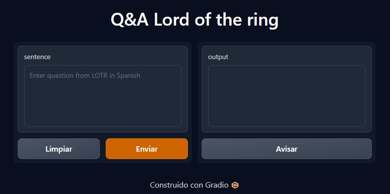

# Embeddings Project

This project focuses on generating embeddings for text data using embeddings 
models. The project is organized as follows:

## Project Structure

- `input/`: The root directory for input data and configuration.
  - `config.yaml`: Configuration file specifying the pipeline and model settings.
  
- `python/`: Python source code organized into different folders:
  - `feature_engineering/`: Contains the feature engineering pipeline responsible 
  for data preprocessing. The YAML input is converted into a DataFrame where each row represents a sentence from the text.
  
  - `metadata/`: Contains a class named `Path` that centralizes all project 
  file paths.
  
  - `modeling/`: Contains the pipeline for calculating embeddings for each 
  sentence.
  
  - `serving/`: Contains the Gradio-based demo for serving the embeddings model.
  
  - `utils/`: Contains various utility functions.
  
- `main.py`: The main entry point of the project that orchestrates the entire 
process.

## Configuration

The project uses a YAML configuration file (`config.yaml`) in the `input/` 
directory to specify the pipeline and model settings. Here's an example 
configuration:

```yaml
pipeline: eval

embedding_model:
    model: sentence-transformers/all-MiniLM-L6-v2
    batch_size: 20

train:
    feature_pipeline:
        save: True
    modeling_pipeline:
        save: True

eval:
    feature_pipeline:
        save: False
    modeling_pipeline:
        save: False
```

# Usage

To run the project, execute main.py. It reads the configuration and determines 
whether to train the model, evaluate it, or run the Gradio demo based on the 
specified pipeline.


# Demo
You can see a live demo of this project by following this link:
`https://huggingface.co/spaces/jarbey92/demo_qa_udea`

